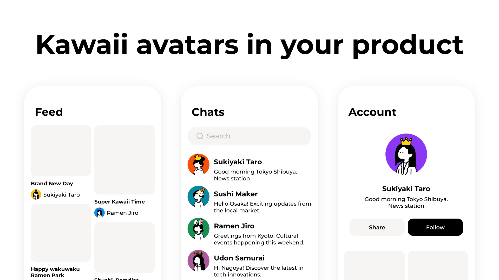

# Humation

**Hand-drawn kawaii avatar engine for your app.**
One seed in, one deterministic avatar out. No AI, no API calls.

<p align="center">
  <a href="https://www.npmjs.com/package/@humation/react"></a>
  <a href="https://github.com/endo-yusuke/humation/releases"></a>
  <a href="./LICENSE"></a>
</p>

<p align="center">
  
</p>

> **MIT licensed.** Code and assets are both MIT. See [License](#license).
>
> **[Docs](https://humation.app/docs)**

## When to use

- Your app needs user avatars and you want a consistent, hand-drawn illustration style
- You want deterministic output: same seed always produces the same avatar
- You want to own the component: install from npm, or copy the source into your project

## Quick start

### 1. Show an avatar (React)

```bash
npm install @humation/react @humation/assets-humation-1
```

```tsx
import { Avatar } from '@humation/react';
import { humation1 } from '@humation/assets-humation-1';

// Automatic — same seed always renders the same avatar
<Avatar assets={humation1} seed={user.id} size={96} />

// Manual — pick parts and colors by name
<Avatar
  assets={humation1}
  selections={{ head: 'braids', body: 'hoodie', item: 'calico-cat' }}
  colors={{ hair: '#4A3728' }}
/>
```

`seed` generates a deterministic combination from any string (user ID, email,
etc.). `selections` lets you pick exact parts per slot. You can combine both —
`selections` overrides whatever `seed` would have chosen for those slots.

### 2. Build a picker UI

Use the core helpers to build a part selection interface:

```ts
import { createPartPreview, getPartsForSlot } from '@humation/core';
import { humation1 } from '@humation/assets-humation-1';

// List all available head parts
const heads = getPartsForSlot(humation1, 'head');
// → [{ name: 'braids', id: 'hm1-p-...', ... }, ...]

// Render a thumbnail for each part
const thumbnail = createPartPreview(humation1, heads[0], {
  colors: { hair: '#4A3728' },
}).toDataUri();
// → data:image/svg+xml;charset=utf-8,...  (use as )
```

`getPartsForUiGroup(humation1, 'cat')` returns parts grouped by UI category
(e.g. all cat variants across slots). Available slots: `head`, `body`,
`bottom`, `item`, `glasses`.

<!-- Avatar builder UI component (copy-paste, not a package) will be available
     via the shadcn registry once this repository is public. -->

### 3. Render SVG anywhere (no framework)

```bash
npm install @humation/core @humation/assets-humation-1
```

```ts
import { createAvatar } from '@humation/core';
import { humation1 } from '@humation/assets-humation-1';

const svg = createAvatar(humation1, { seed: 'felix' }).toString();

const custom = createAvatar(humation1, {
  selections: { head: 'wavy-long', body: 'hoodie', item: 'black-cat' },
  colors: { hair: '#123456', skin: '#FFEECC' },
}).toString();
```

Works in Node, Deno, Bun, edge functions — anywhere that runs JavaScript.
Output is a self-contained SVG string with no external dependencies.

## Saving state

To persist a user's avatar, save the selections and colors:

```ts
const state = {
  selections: { head: 'braids', body: 'hoodie', item: 'calico-cat' },
  colors: { hair: '#4A3728', skin: '#F4C9A8' },
};

// Later, restore:
<Avatar assets={humation1} selections={state.selections} colors={state.colors} />
```

For seed-based avatars, save the seed string. For manually customized avatars,
save the `selections` object (part names per slot) and `colors` object.
Part names are stable across versions; canonical IDs (`hm1-p-000023`) are also
accepted for guaranteed stability.

## How it works

**Deterministic rendering.** `seed` → FNV-1a hash → part selection per slot.
Same seed, same SVG. No network, no randomness.

**CSS variable recoloring.** Rendered SVGs use `var(--hm-hair)`,
`var(--hm-skin)`, etc. — recoloring is a pure CSS cascade, no re-render:

```css
.dark .avatar { --hm-stroke: #e5e5e5; --hm-clothes: #2a2a2a; }
```

**Named parts.** Every part has a unique name within its slot (`braids`,
`hoodie`, `camera`). Use `getPartsForSlot()` to list available parts
programmatically.

**Color slots.** `hair`, `clothes`, `bottom`, `skin`, `stroke`, `background`.
Hex values work with or without `#`.

## Packages

| Package | Description |
| --- | --- |
| [`@humation/core`](packages/core) | Manifest validation, SVG rendering, and UI helpers |
| [`@humation/assets-humation-1`](packages/assets-humation-1) | Humation 1 manifest and SVG assets (86 parts) |
| [`@humation/react`](packages/react) | `<Avatar>` React component |
| [`@humation/web-component`](packages/web-component) | `<humation-avatar>` custom element |

> v1.0.0

## Development

```bash
bun install
bun run typecheck
bun run test          # builds packages, runs asset tests, renders the example
bun run pack:smoke    # packs npm tarballs and installs them in a clean project
```

The Node example writes `examples/node/out/avatar.svg` and `avatar.html`:

```bash
bun run example:node
```

New to the codebase? Start with
[docs/design-decisions.md](docs/design-decisions.md) — the one-page summary
of every locked design decision and the remaining release work.

Release tooling (see [docs/humation-oss-release-checklist.md](docs/humation-oss-release-checklist.md)):

```bash
bun run release:check               # publish blockers; fails until release is prepared
bun run release:prepare -- 0.1.0    # dry run
bun run release:prepare -- 0.1.0 --write
```

## License

MIT. See [LICENSE](LICENSE) for details.
